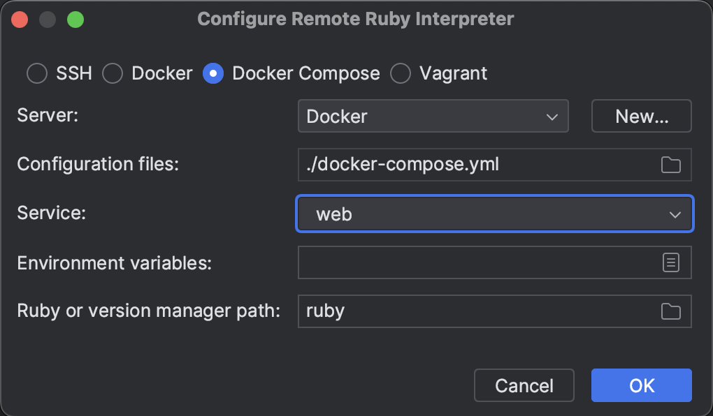
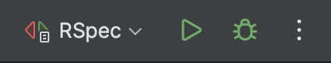
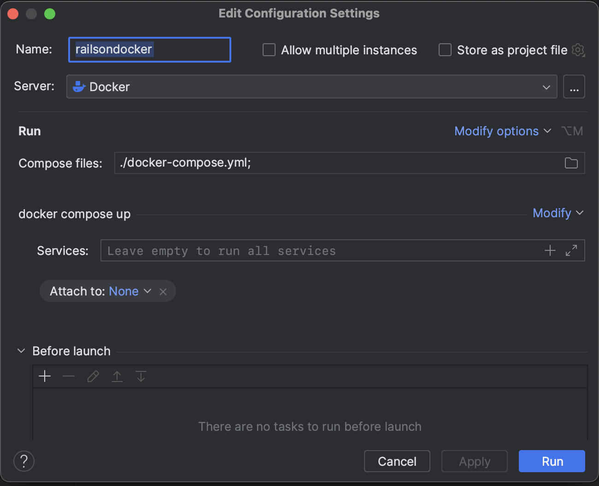
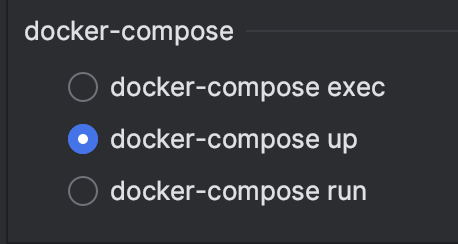

# Rails on Docker

This example app started by following the book Docker For Rails Developers and has been updated by me as time goes on. This is a "containerized" Rails app with the following primary features:

* Redis
* Postgres database
* esbuild for compiling JavaScript
* Sass processing into CSS
* [Testing with RSpec](#testing)
* [Debugging with breakpoints](#debugging)
* TODO: Deployment on Render
* TODO: Development vs production configuration

I've also included notes for using RubyMine and getting breakpoint debugging working nicely.

## Housekeeping

By default, Ruby buffers output to `stdout`, which doesn't play well with Compose. Let’s fix this by switching off Ruby’s output buffering. Add the following line to the top of your `config/boot.rb` file:

```
$stdout.sync = true
```

### Environment variables
You will need to populate an `.env` directory at the root of your app. These files are sensitive and should not be checked into version control. The directory structure should look like:

```
.env
└── development
    ├── database
    └── web
```

Those files are referenced in `docker-compose.yml`. Here is some example content:

**.env/development/database**

```
POSTGRES_USER=postgres
POSTGRES_PASSWORD=aGoodStrongPassword
POSTGRES_DB=myapp_development
```

**.env/development/web**

```
 DATABASE_HOST=database
```

### RubyMine Setup

You'll need to define a remote interpreter for your project to get everything to play together nicely. Remember, you're not running Ruby off your local machine, nor are you installing any gems there. RubyMine needs to know where to look for all that stuff.

1. Use the shortcut **cmd+,** to bring up **Settings**.
2. Click **+** under **Languages & Frameworks | Ruby SDK and Gems** and choose **Remote Interpreter or Version Manager**.
3. Choose **Docker Compose**
4. Point **Configuration files:** at your `docker-compose.yml`.
5. Select **web** as your **Service:**
6. Click **OK**




## Running the app

Use Docker Compose to specify your needs in a declarative way and let it do all the heavy lifting.

```shell
docker compose up

# If anything seems "cached" and you wan to start fresh:
docker compose up --build
```

*Compose will only build images if they don't exist. You are responsible for rebuilding things as needed.*

## Interactive shell for `web`

If you've dockerized your Rails app, then you're no longer going to run `rails` commands from your local terminal. Heck, you might not even have the correct Ruby version installed or any of your app's gems. All that stuff is in the containers you've set up.

Instead, we can run bash and attach to the already running `web` container. (This assume you've already done `docker compose up`)

```shell
docker compose exec web bash
```

Now that you've got an interactive shell, you can go to town with stuff like `rails db:migrate` or any other useful `rails` commands.

If you need to issue a command to a non-running container:

```shell
docker compose run web bash
```

## Testing

This repo uses RSpec for testing and you can use `rspec` from an interactive prompt (like above) to start running tests, even JavaScript system tests with Capybara.

```shell
# Start all your containers
docker compose up

# Open another terminal window and
docker compose exec web bash

# Run your test like you normally would
rspec
```

### Using RubyMine

RubyMine has some built-in abilities to run our tests. Here's how I go about setting that up.

1. Click **Run | Edit Configurations** from the main toolbar (MacOS).
2. Click **+** and choose the **RSpec** configuration.
3. Set **Mode:** to **All specs in folder**.
4. Point **Specs folder:** to your tests folder. Usually **/spec** in your application's directory
5. **File name mask:** `**/*_spec.rb`
6. In the **docker-compose** section choose **docker-compose exec**. This is going to assume you're actively working on your code and have run `docker compose up` to start all your services.
7. Click **Apply** and close out the window.

You should now have access to an RSpec option in the **Run/Debug** section.



### Viewing system tests

You can see your system tests running in an browser by opening up the Screen Sharing app on your Mac. You'll connect to `localhost:5900` and enter in the password `secret`. Doing this will allow you to watch the tests as they run -- they'll be fast!

## Debugging

If you would like to debug by dropping a `debugger` in your code to get an interactive session, you'll need to stop the currently running Rails server

```shell
docker compose stop web
```

Then, you'll start it back up again, but in a slightly different way:

```shell
docker compose run --service-ports web
```

Once you've done that, your `debugger` breakpoints should work.

### Using RubyMine

If you're interested in getting RubyMine's native debugging tools to work, like clicking to get a breakpoint in the gutter, you'll need to do the following:

1. Start all your services with either `docker compose up` or by creating a Docker **Run/Debug** configuration.

    

2. Next, you're going to create a **Rails** **Run/Debug configuration** with the default settings and make sure **docker-compose up** is selected in the **docker-compose** section.

    

3. Now comes the key part. If you properly set up your remote interpreter mentioned in the [housekeeping section](#rubymine-setup) you should be able to run the **Rails** configuration you just created. This will shut down the running *web* service and fire up a replacement. *This* is what allows RubyMine's debugger to attach and you can drop breakpoints in the gutters of your files and be able to use the GUI to step through things or use the console to inspect.

---

If you enjoy helpful things like what you've read here, consider stopping by my website [matthaliski.com](https://matthaliski.com). You might find more useful info! 😁
